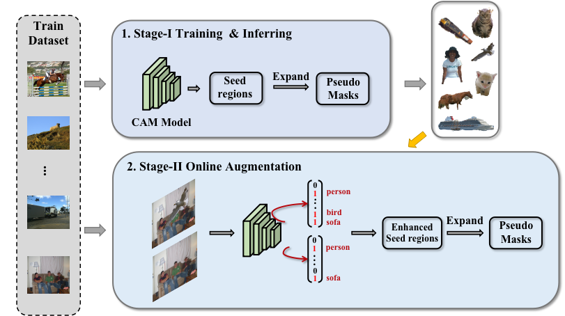

# Context Decoupling Augmentation for Weakly Supervised Semantic Segmentation
<p align="center"></p>
The code of:

Context Decoupling Augmentation for Weakly Supervised Semantic Segmentation , [Yukun Su](https://github.com/suyukun666), [Ruizhou Sun](https://github.com/lianchengmingjue), Guosheng Lin, Qingyao Wu (https://arxiv.org/abs/2103.01795)

Data augmentation is vital for deep learning neural networks. By providing massive training samples, it helps to
improve the generalization ability of the model. Weakly supervised semantic segmentation (WSSS) is a challenging problem that has been deeply studied in recent years, conventional data augmentation approaches for WSSS usually employ geometrical transformations, random cropping and color jittering. However, merely increasing the same contextual semantic data does not bring much gain to the networks to distinguish the objects, e.g., the correct image-level classification of “aeroplane” may be not only due to the recognition of the object itself, but also its co-occurrence context like “sky”, which will cause the model to focus less on the object features. To this end, we present a Context Decoupling Augmentation (CDA) method, to change the inherent context in which the objects appear and thus drive the network to remove the dependence between object instances and contextual information. To validate the effectiveness of the proposed method, extensive experiments on PASCAL VOC 2012 dataset with several alternative network architectures demonstrate that CDA can boost various popular WSSS methods to the new state-of-the-art by a large margin.

Thanks to the work of [jiwoon-ahn](https://github.com/jiwoon-ahn), our work is mainly based on his [IRNet](https://github.com/jiwoon-ahn/irn) respository. Besides, for clarity, we only provide the IRN augmentation code. You can use the same modifications for [SEAM](https://github.com/YudeWang/SEAM) and [AffinityNet](https://github.com/jiwoon-ahn/psa). The model weights are given below.
## Citation
If you find the code useful, please consider citing our paper using the following BibTeX entry.
```
@InProceedings{CDA_2021_ICCV,
author = {Yukun Su and Ruizhou Sun and Guosheng Lin and Qingyao Wu},
title = {Context Decoupling Augmentation for Weakly Supervised Semantic Segmentation},
booktitle = {Proceedings of the IEEE/CVF International Conference on Computer Vision (ICCV)},
month = {October},
year = {2021}
}

```

## Prerequisite
* Python 3.7, PyTorch 1.1.0, and more in requirements.txt
* PASCAL VOC 2012 devkit
* NVIDIA GPU with more than 1024MB of memory

## Usage

#### Install python dependencies
```
pip install -r requirements.txt
```
#### Download PASCAL VOC 2012 devkit
* Follow instructions in http://host.robots.ox.ac.uk/pascal/VOC/voc2012/#devkit

#### Run run_sample.py or make your own script
```
python run_sample.py
```
* You can either mannually edit the file, or specify commandline arguments.


## Results and Trained Models
#### Class Activation Map

| Model          | Train (mIoU)    | |
| ------------- |:-----:|:-----:|
| ResNet-50 for IRnet    |  50.8 | [[Weights]](https://drive.google.com/file/d/1pnax7NkCMLEGD4QM7eH6YMcQES2uskJV/view?usp=sharing) |
| ResNet-38 for SEAM    |  58.4 | [[Weights]](https://drive.google.com/file/d/14ewWX7v0E9HWf1Azu3ttnvd6gDRcbvXG/view?usp=sharing) |
| ResNet-38 for AffinityNet    |  48.9 | [[Weights]](https://drive.google.com/file/d/1sPcJor5-61VJicvONJWVO_7HI8aK14ua/view?usp=sharing) |


#### Pseudo Mask Models

| Model         | Train (mIoU)    | |
| ------------- |:-------------:|:-----:|
| ResNet-50 for IRnet    |  67.7 | [[Weights]](https://drive.google.com/file/d/16lDaMRVHEmk5YSBwPU3eMuNq9u6UA8rS/view?usp=sharing) |
| ResNet-38 for SEAM    |  66.4 | [[Weights]](https://drive.google.com/file/d/1wnbLQeStSrTkw2UvatOgZNEtaZZLvehx/view?usp=sharing) |
| ResNet-38 for AffinityNet    |  63.3 | [[Weights]](https://drive.google.com/file/d/1p7s2RKbVVhVnTHETxDbRBE8_ropS0T_3/view?usp=sharing) |


## References
1. Ahn, Jiwoon and Cho, Sunghyun and Kwak, Suha. Weakly Supervised Learning of Instance Segmentation with Inter-pixel Relations. *CVPR*, 2019.<br>
[Project](https://github.com/jiwoon-ahn/irn) /
[Paper](https://arxiv.org/abs/1904.05044)
2. Yude Wang and Jie Zhang and Meina Kan and Shiguang Shan and Xilin Chen. Self-supervised Equivariant Attention Mechanism for Weakly Supervised Semantic Segmentation.*CVPR*, 2020. <br>
[Project](https://github.com/YudeWang/SEAM) /
[Paper](https://arxiv.org/abs/2004.04581)
3. Ahn, Jiwoon and Kwak, Suha. Learning Pixel-Level Semantic Affinity With Image-Level Supervision for Weakly Supervised Semantic Segmentation.*CVPR*, 2018. <br>
[Project](https://github.com/jiwoon-ahn/psa) /
[Paper](https://arxiv.org/abs/1803.10464)
